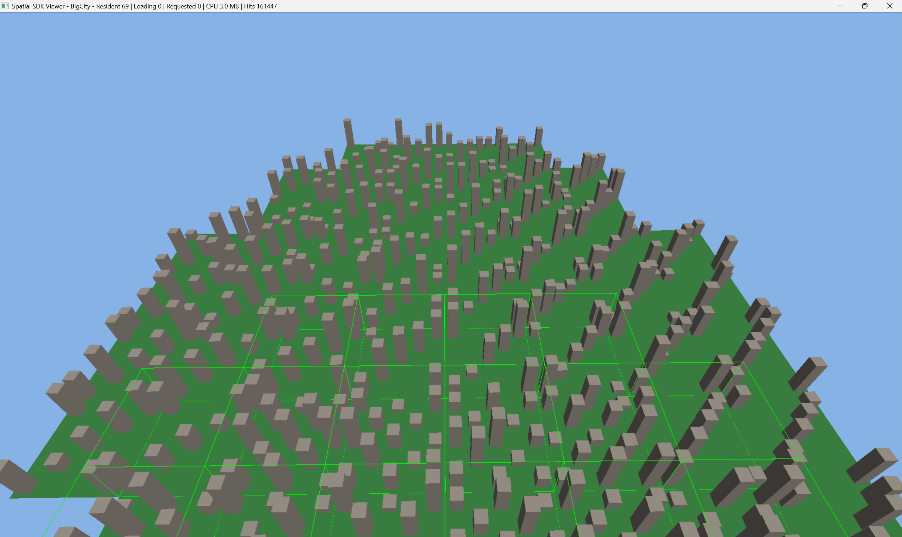

# Cross-Engine Spatial Data Streaming SDK

A portable C++20 SDK for loading, streaming, and rendering large spatial 3D
datasets (city/world-scale) from an engine-independent core, with thin
integration layers for a custom C++ renderer, Unity, and Unreal Engine.

```
        ┌─────────────┐
        │ Spatial SDK │
        └──────┬──────┘
               │
      ┌────────┼────────┐
      │        │        │
    Unity   Unreal   Custom C++
```

The core SDK has no dependency on Unity or Unreal — it compiles and is fully
testable on its own. Engine plugins are adapters that implement a single
rendering interface (`IRenderer`) and call the public API.



*`StandaloneViewer` streaming a 1,024-tile procedural city in real time — 69
tiles resident at this camera position, debug overlay (`F1`) showing
color-coded tile bounds. Title bar shows live streaming stats.*

## Status

**Phase 12 of 14.** Complete: core spatial math; a binary tile format with
a JSON manifest and a `SpatialTileBuilder` CLI that generates a procedural
city; a generic quadtree spatial index; distance/screen-space-error LOD
selection with hysteresis; a multithreaded streaming manager (request
queue, worker pool, validated resource state machine, priority,
cancellation); a memory-budgeted tile cache with combined priority/recency
eviction; an engine-agnostic rendering abstraction (`IRenderer`, RAII GPU
resources, a bounded upload queue, batched debug-line rendering);
**`StandaloneViewer`** — a Win32 window and Direct3D 11 backend wiring the
above against a generated dataset; **`spatial::SpatialWorld`** — the
single façade class an engine integration owns instead of wiring five
subsystems together itself; a **Unity native plugin**; an **Unreal native
plugin**; and a **custom-engine integration** — validated against an
independent DirectX 12 engine, linking `spatial_sdk` directly rather than
through a C ABI, with no coordinate conversion needed since that engine
shares the SDK's own right-handed/Y-up convention.

181 automated SDK tests, all green. The viewer and both engine plugins are
runnable end to end. See [docs/architecture.md](docs/architecture.md) for
the full design and phased development plan, and
[CHANGELOG.md](CHANGELOG.md) for what landed in each phase.

Not yet built: profiling tooling (Phase 13) and final portfolio polish
(Phase 14).

## Planned capabilities

- [x] Spatial tile hierarchy (quadtree) with efficient frustum/distance queries
- [x] Distance-based, then screen-space-error-based, level of detail
- [x] Asynchronous, priority-driven tile streaming with a documented per-tile
      state machine and cancellation
- [x] CPU/GPU memory budgets with combined priority/recency eviction and a tile cache
- [x] An engine-agnostic rendering abstraction (`IRenderer`) with a real
      Direct3D 11 backend
- [x] A standalone C++ viewer (`StandaloneViewer`) — free-fly camera,
      streamed world, LOD, debug visualization, runtime stats
- [x] A `SpatialWorld` public API façade tying the above together for
      engine integrations to build on
- [x] A Unity plugin (native C ABI + C# layer + `SpatialWorldComponent`)
- [x] An Unreal plugin (native C ABI + `USpatialWorldComponent`)
- [x] A custom-engine integration (direct C++ linkage, zero coordinate
      conversion) validated against a real DirectX 12 engine
- [x] A `SpatialTileBuilder` command-line tool that converts procedural
      geometry into the SDK's dataset + tile format (glTF/OBJ import planned)

## Building

See [docs/getting_started.md](docs/getting_started.md).

```bash
cmake -S . -B build -G "Visual Studio 17 2022" -A x64
cmake --build build --config Debug
ctest --test-dir build -C Debug --output-on-failure
```

## Documentation

- [Architecture](docs/architecture.md)
- [Getting started](docs/getting_started.md)
- [Public SDK API](docs/sdk_api.md)
- [Tile format](docs/tile_format.md)
- [Level of detail](docs/lod.md)
- [Streaming](docs/streaming.md)
- [Rendering](docs/rendering.md)
- [Unity integration](docs/unity_integration.md)
- [Unreal integration](docs/unreal_integration.md)
- [Custom engine integration](docs/custom_engine_integration.md)

## License

MIT — see [LICENSE](LICENSE).
