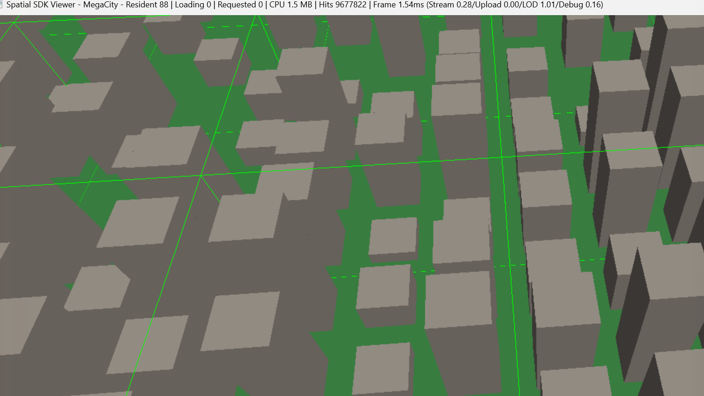

# Technical Case Study

This is a design-decision-and-results write-up of the SDK, aimed at a reader
who already knows what streaming/LOD/spatial-indexing systems are and wants
to know *why* this one is built the way it is, what it actually measures
out to, and what broke along the way. The per-module docs (`lod.md`,
`streaming.md`, `rendering.md`, `profiling.md`, etc.) cover implementation
detail; this page is the summary a reviewer would want first.

## The core problem

A tiled world too large to hold entirely in memory needs three things
working together: a way to know which tiles are relevant to the current
camera (spatial index), a way to decide how much detail each relevant tile
needs (LOD), and a way to load/unload tile data without stalling a frame
(streaming). None of those three are hard in isolation. The actual
engineering problem is the boundary between them — a naive
streaming-triggers-a-load pattern is easy to get wrong on cancellation,
memory budgets, or GPU-resource lifetime, and every one of those failure
modes showed up during development (see "What broke", below).

## Why these design choices

**Right-handed, Y-up coordinate convention for `Mat4`.** Most of the DirectX
ecosystem defaults to left-handed. Choosing right-handed/Y-up here (Phase 2)
was a bet that it would match more target engines than not — a bet that
paid off directly in Phase 12: the target custom engine's math library
turned out to already be right-handed/Y-up with the same triangle winding,
so the entire integration needed zero coordinate conversion code. Unity and
Unreal, which don't share that convention, needed explicit conversion
layers instead — see below.

**A generic quadtree (`SpatialIndex<T>`), not a tile-specific one.** The
Core layer has zero dependency on the tile/dataset model by design (see the
module map in `architecture.md`) — `TileIndex` is a thin wrapper combining
`SpatialIndex<TileId>` with an id lookup map. The benchmark in
`SpatialIndexBenchmark.cpp` (excluded from the default test run, run
manually) confirms indexed queries beat brute force at the scale this
project actually uses; it wasn't a given until measured.

**Screen-space error, not just distance-based LOD, with hysteresis.**
Distance-only LOD selection is simple but produces frame-to-frame LOD
"popping" for a camera moving near a boundary. `LODManager<Key>` holds
state per key and only switches LOD once a selection has been stable long
enough, independent per tile — a fast-moving camera and a stationary one
get different, correct behavior without either one needing special-case
code.

**Priority-weighted, cancellable streaming requests, not a simple FIFO
load queue.** `RequestQueue` supports lazy-deletion cancellation and
push-time deduplication specifically because a camera can leave a tile's
relevance radius before that tile's load has even started — issuing the
load anyway wastes a worker-thread slot on data that will be immediately
discarded. `StreamingManager` also discards results for loads that
complete after they're no longer wanted, which is a different failure mode
(the load already happened; the data just needs to be dropped) from
cancellation (the load hasn't started yet).

**A combined priority/recency cache score, not separate LRU and
distance-priority eviction policies.** `TileCache` evicts by
`keepScore = lastPriority - recencyWeight * framesSinceLastTouched`, one
formula instead of two competing policies that would need their own
tie-breaking rules. Phase 7 changed `StreamingManager` to retain a tile
that leaves the streaming radius (previously: unload immediately) so the
cache — not the streaming radius alone — decides what actually gets evicted
under memory pressure. This is also what makes a camera moving back and
forth across a boundary cheap: a tile that left and re-entered the radius
before being evicted is a cache hit, not a reload.

**A C ABI for Unity and Unreal; direct C++ linkage for the custom engine.**
Not a fixed rule — the SDK exposes `SpatialWorld` as an ordinary C++ class
first. Unity's P/Invoke marshaler can only cross into C++ through free
functions and fixed-layout structs, so a C ABI (`SpatialUnityPlugin.h`) is
required, not optional. Unreal *could* link C++ directly, but pins its own
MSVC toolset and CRT settings per engine release with no guarantee they
match this repo's CMake build — a mismatch there is silent heap corruption
at a C++ ABI boundary, not a compile error, so a C ABI (`SpatialUnrealPlugin.h`)
was chosen defensively even though it wasn't strictly forced. The custom
engine's `.vcxproj` settings (MSVC v143, C++20, `/MD` Release / `/MDd`
Debug) were checked directly against this repo's own CMake output before
deciding direct linkage was safe — confirming that match, rather than
assuming it, is what made the zero-C-ABI integration possible.

**Coordinate conversion lives at the boundary, not in the SDK.** Unity's
conversion (Z-negation, winding reversal) is done C#-side, in the thinnest
layer above the native plugin. Unreal's conversion (axis swap, 100x scale,
winding reversal) was moved *into* the native plugin instead — a
refinement made after seeing Unity's approach in practice, since doing it
natively means every exported function already returns Unreal-space-ready
data and the managed-code layer above it does no conversion math at all.
Either way, `spatial::core::Mat4` itself never changes meaning — the
conversion is entirely the integration layer's responsibility.

## What broke, and what it means

Every one of these was found by actually running the integration, not
predicted in advance:

- **GPU-upload callback use-after-free.** An upload callback captures a
  reference to its tile's GPU record so it can write the finished resource
  into it — but a tile can be evicted (erasing that record) while the
  upload is still in flight. Fixed with deferred erasure: a record marked
  no-longer-resident isn't actually erased until every upload that
  captured a reference to it has completed. This is the general shape of a
  problem any async-resource system with a callback-writes-into-a-container
  pattern will hit, not something specific to this SDK's resource type.
- **Renderer/`SpatialWorld` declaration-order lifetime bug.** GPU resources
  inside `SpatialWorld` hold pointers into the `IRenderer` that created
  them. Declaring `SpatialWorld` *before* the renderer in a scope means the
  renderer gets destroyed first at scope exit, and `SpatialWorld`'s
  destructor then calls into a dead renderer — a real crash (SIGSEGV) hit
  once in the test suite before the rule ("renderer must outlive world")
  was documented at every call site that has both.
- **Debug-wireframe height bug.** The debug tile-bounds overlay used
  `TileIndex`'s bounds, whose Y range came from a generic
  `[-1000, 1000]` placeholder rather than the dataset's real height range —
  every wireframe box was 2000 units tall regardless of what was actually
  in the tile. Traced to a missing field (`DatasetManifest` had no real
  height-range field yet) rather than a logic bug — fixed at the root by
  adding `worldHeightMin`/`worldHeightMax` to the manifest format, with the
  debug overlay preferring a resident tile's own tight bounds as a
  secondary fix.
- **Unreal: missing light source.** The scene had no light, so every
  `UProceduralMeshComponent` rendered pure black against an equally black
  background — geometrically correct, visually indistinguishable from
  broken. Fixed by spawning an `ADirectionalLight` in the demo game mode.
  A reminder that "nothing renders" and "nothing is lit" produce the exact
  same screenshot.
- **Unreal: `FMatrix` row-vector vs. `Mat4` column-vector convention
  mismatch.** Unreal stores translation in a matrix's last row; this SDK's
  `Mat4` stores it in the last column. Harmless while `SpatialWorld` only
  ever passed an identity transform (which is its own transpose), but a
  correctness bug waiting for the first non-identity transform to expose
  it. Fixed in `BuildTransform()`, verified both by a unit test and
  visually (solid, correctly-lit geometry with visible light/shadow
  faces on the affected faces, not just "it compiles").
- **Custom-engine integration: precompiled-header include-order.** The
  target engine's PCH (`Globals.h`) has to be the *first* include in any
  `.cpp` that uses it — anything placed before it is silently dropped by
  MSVC's PCH substitution, which produces bizarre, seemingly unrelated
  errors (`'std::span' is not a member of 'std'`) far from the actual
  mistake. Diagnosed by comparing include order against every other file
  in that codebase rather than guessing from the error text.
- **Custom-engine integration: incomplete-type destructors.** A class
  holding `std::unique_ptr<T>` (here, `Mesh`/`Material`) as a member needs
  its destructor defined somewhere `T` is a complete type — inline defaults
  in the header aren't enough once `T` is only forward-declared there. Hit
  at two nested levels (the renderer, then the component holding it by
  value) and fixed the same way both times: declare the destructor in the
  header, define it in a `.cpp` that fully includes the pointee types.

## Stress test: streaming vs. full residency

*`StandaloneViewer` against `MegaCity`, the largest of the three stress-test
datasets below — 88 tiles resident, ~1.5 MB CPU memory, debug tile-bounds
overlay on, live per-section frame timing in the title bar.*

Three procedurally generated datasets at increasing scale, same generator
and per-tile complexity (`--tile-size 100 --max-lod 3`, default building
density), only the grid size changed:

| Dataset  | Tiles  | World size | Disk footprint |
|----------|-------:|-----------:|----------------:|
| BigCity  |  1,024 |    3,200 m |            49 MB |
| MidCity  |  4,096 |    6,400 m |            82 MB |
| MegaCity | 16,384 |   12,800 m |           327 MB |

**Streaming** (`StandaloneViewer`'s default `--streaming-radius 400
--max-resident-tiles 256 --cpu-budget-mb 512`, camera stationary at the
world's origin, measured after streaming converges):

| Dataset  | Resident tiles | CPU memory in use |
|----------|---------------:|-------------------:|
| BigCity  |             68 |             2.97 MB |
| MidCity  |             66 |             1.16 MB |
| MegaCity |             68 |             1.20 MB |

**Full residency** (streaming radius and budgets widened until every tile
in the dataset is loaded, to measure what the naive "just load everything"
alternative costs):

| Dataset  | Resident tiles | CPU memory in use | Time to converge |
|----------|---------------:|--------------------:|-------------------|
| BigCity  |   1,024 (100%) |             44.74 MB | ~12 s |
| MidCity  |   4,096 (100%) |             72.09 MB | ~16 s |
| MegaCity | 15,224 (93%)   |            267.96 MB | not converged after 90 s |

The comparison is the point: growing the dataset 16x (1,024 → 16,384
tiles) leaves the streaming working set essentially flat — resident tile
count and CPU memory barely move, because both are bounded by the
streaming radius and budget configuration, not by how large the dataset
is. The same growth under full residency is roughly linear in memory (44.7
MB → 268 MB) and worse than linear in load time (12 s → still incomplete
past 90 s, since more concurrent in-flight loads compete over the same
fixed worker-thread pool). This is the concrete answer to "why stream
instead of just loading the world" — not a claim, a measured contrast on
the same hardware, generator, and per-tile complexity.

## Where this leaves the project

Three independent engine integrations validate the "engine-agnostic core,
thin adapter per engine" architecture from three different angles: Unity
(forced C ABI, conversion above the native boundary), Unreal (chosen C ABI
for toolchain-mismatch safety, conversion moved into the native boundary
after learning from Unity), and a custom DirectX 12 engine (direct C++
linkage, zero conversion, validating the Phase 2 coordinate-convention
choice). The stress test above demonstrates the actual value of the
streaming architecture in numbers rather than description. 187 automated
tests and a working profiler round out a system that's been run, not just
compiled.
